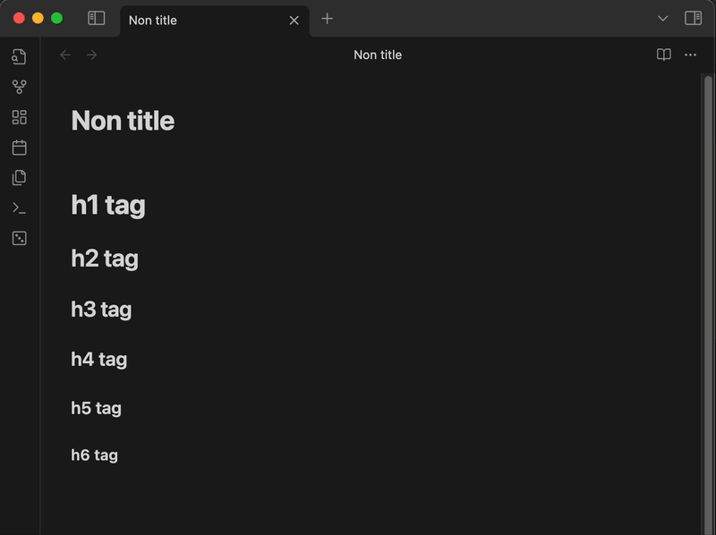
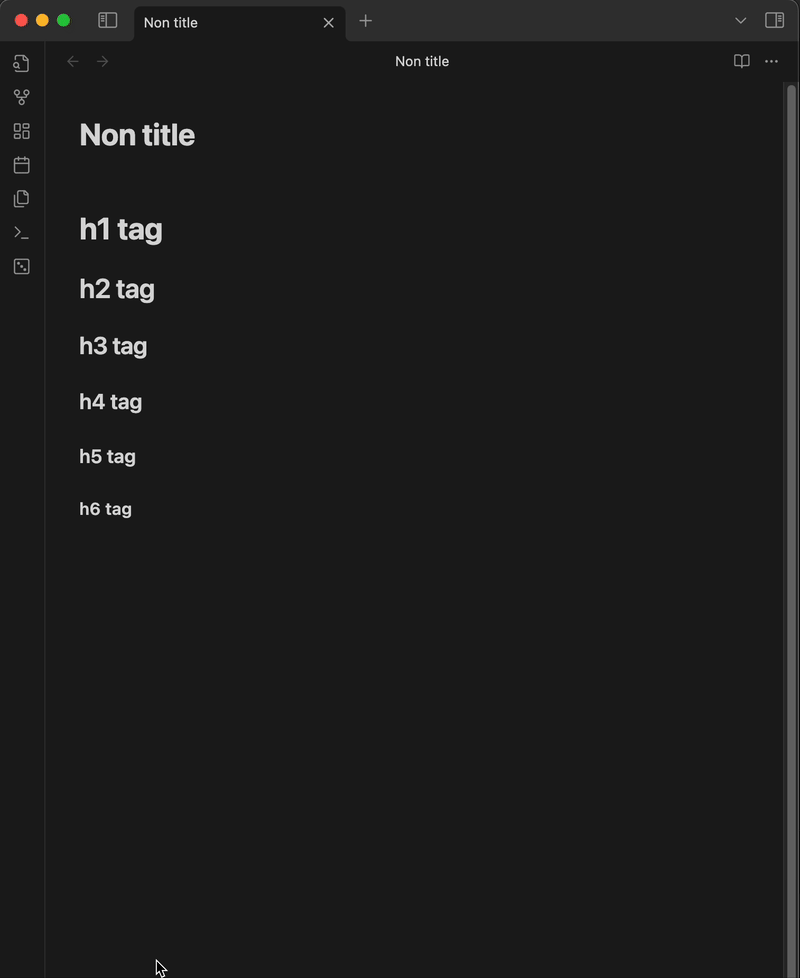

<h1 align="center">Hx to WikiLink</h1>

An Obsidian plugin that converts Markdown headings (`#` to `######`) into
WikiLinks like `[[Heading]]`.

Each heading level (H1–H6) can be individually enabled or disabled, and you can
choose whether to replace the heading or insert the WikiLink below it.

## Features

- Convert H1–H6 Markdown headings to WikiLinks.
- Optional command to convert all heading levels at once.
- Per-level toggle (enable/disable) for each heading level (H1–H6).
- Configurable behavior: **replace** heading or **duplicate** WikiLink below it.
- Commands accessible from the Command Palette.

## Example

### Input:

```markdown
# Hello World

## Section 1
```

### Output (Replace mode):

```markdown
[[Hello World]]

[[Section 1]]
```



### Output (Duplicate mode):

```markdown
# Hello World

[[Hello World]]

## Section 1

[[Section 1]]
```



## Settings

Open **Settings → Hx to WikiLink** to configure:

- **Duplicate WikiLink** → If enabled, the WikiLink will be added below the
  heading instead of replacing it.

- **Enabled Commands** → Toggle each heading level (H1–H6) and "All Hx" command
  individually.

## Installation

Until it's available in the Obsidian Community Plugins, you can install it
manually:

1. Clone or download this repository.
2. Copy the contents into your `.obsidian/plugins/hx-to-wikilink` folder.
3. Enable the plugin in **Settings → Community plugins**.

## License

This project is licensed under the [MIT License](./LICENSE).
